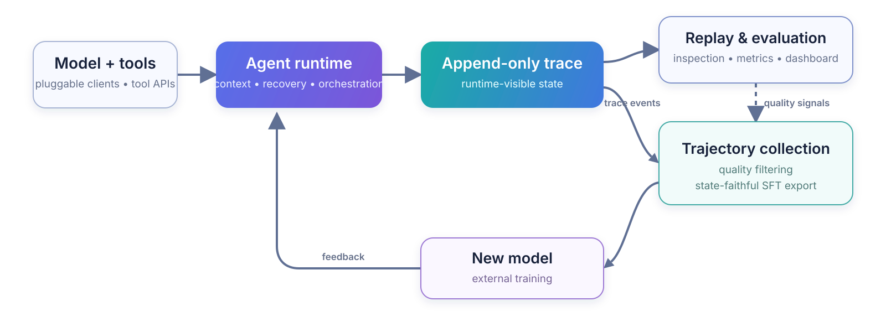

<div align="center">
  <picture>
    <source media="(prefers-color-scheme: dark)" srcset="docs/assets/axisagentic-logo-dark.svg">
    <source media="(prefers-color-scheme: light)" srcset="docs/assets/axisagentic-logo-light.svg">
    
  </picture>

  <p>
    <strong>English</strong> ·
    <a href="README.zh-CN.md">简体中文</a>
  </p>

  <p>
    <a href="https://github.com/XYZ-AI-Lab/AxisAgentic/actions/workflows/ci.yml"></a>
    
    <a href="https://github.com/astral-sh/ruff"></a>
    <a href="LICENSE"></a>
    <a href="CONTRIBUTING.md"></a>
  </p>

  <p>
    <a href="https://xyz-lab.ai">XYZ AI Lab</a> ·
    <a href="https://xyz-lab.ai/blogs/ai4ai-at-scale/">Technical Report</a>
  </p>
</div>

AxisAgentic is an extensible runtime for long-horizon AI agents. It also collects the trajectories produced during execution. The runtime works with OpenAI-compatible endpoints and pluggable local model clients, and handles multi-turn execution, tool orchestration, context management, recovery, and benchmark evaluation. Each trace preserves the state visible to the model, so the same record can support recovery and replay, benchmark evaluation, or filtered SFT export.

Web Search and WideSearch are the current reference recipes. The same extension points can support domain, general-purpose, and coding agents. This repository does not include model weights.

## ✨ Core capabilities

- Append-only traces preserve runtime events and reconstruct the context visible to the model at any stage.
- Model clients, tools, orchestrators, datasets, evaluators, reward functions, and recipe policies are replaceable.
- Context budgets, compaction, rollback, retries, recovery, self-verification, and tool limits support long runs.
- Each task records traces, token and timing metrics, evaluation artifacts, and provenance for trajectory selection.
- SFT exporters replay runtime visibility markers, while rollout interfaces connect execution to external training systems.
- Strict YAML schemas and portable path schemes keep runs reproducible across environments.

## 🔁 From execution to learning

Every task writes an append-only trace. The trace is the common source for replay, evaluation, and trajectory collection. Selected trajectories can then be exported for external training.

<picture>
  <source media="(prefers-color-scheme: dark)" srcset="docs/assets/axisagentic-execution-learning-loop-dark.svg">
  <source media="(prefers-color-scheme: light)" srcset="docs/assets/axisagentic-execution-learning-loop-light.svg">
  
</picture>

Runtime markers record rollback, context compaction, and discard-all events. Replaying them reconstructs what the model saw at a given stage. Trace inspection and SFT export use the same rules, so supervised examples exclude hidden history and rolled-back actions.

Recipe exporters emit Swift Agent and related training formats with the source trace, task status, and optional metadata. The external training pipeline owns final correctness filters, loss masks, and optimization. AxisAgentic supplies the replay and export boundary so inference and training use the same interaction history.

## 🦅 Flagship reference: XYZ-Aquila

XYZ-Aquila is a search system built with AxisAgentic. Its recipe combines search and scraping with context management, recovery, evaluation, and state-faithful SFT export. The underlying interfaces also work with other model clients, tools, and task domains.

### 📊 Results

The [Aquila technical report](https://xyz-lab.ai/blogs/ai4ai-at-scale/) reports XYZ-Aquila-mini and XYZ-Aquila-pro across seven agentic benchmarks. The figure below reproduces the reported comparisons for six of them.


*Metrics: BrowseComp, BrowseComp-ZH, LiveBrowseComp, and Humanity's Last Exam use LLM-judge accuracy; DeepSearchQA uses macro F1; WideSearch uses item-level F1 Max@4. See [Evaluation and reproducibility](docs/evaluation.md) for details.*

Some baseline values come from public reports with different harnesses, tools, judges, and evaluation dates. Treat the figure as a benchmark-level comparison rather than a controlled universal ranking.

## 🚀 Get started

AxisAgentic requires Python 3.12 or newer and an OpenAI-compatible model endpoint. [Getting started](docs/getting-started.md) covers installation, provider variables, recipe configuration, dry runs, replay, and SFT export. See [Configuration](docs/configuration.md) for the full configuration reference.

```bash
git clone https://github.com/XYZ-AI-Lab/AxisAgentic.git
cd AxisAgentic
python3.12 -m venv .venv
source .venv/bin/activate
./setup_env.sh
source .envs/axis_agentic_env.sh
cp .env.example .envs/.env
```

After setting the provider and dataset values, validate the Web Search recipe without starting a run:

```bash
cp recipe/web_search/configs/default.yaml my-search-run.yaml
python -m recipe.web_search.runners.run_eval_config \
  --config my-search-run.yaml \
  --dry-run
```

## 📚 Documentation

- [Documentation index](docs/README.md)
- [Getting started](docs/getting-started.md)
- [Configuration](docs/configuration.md)
- [Architecture](docs/architecture.md)
- [Project structure](docs/project-structure.md)
- [Evaluation and reproducibility](docs/evaluation.md)
- [Recipes](recipe/README.md)

## 🤝 Contributing

The [contributing guide](CONTRIBUTING.md) covers development setup and required checks. Contributors must follow the [Code of Conduct](CODE_OF_CONDUCT.md). Report vulnerabilities through the [security policy](SECURITY.md).

## 📜 License

Unless otherwise noted, AxisAgentic is licensed under the [Apache License 2.0](LICENSE). See [NOTICE](NOTICE) for third-party attribution and licensing notes.

## 📝 Citation

If you use this codebase, please cite the software:

```bibtex
@software{wang2026axisagentic,
  author       = {Wang, Jinyu and Zhang, Yifei and {{XYZ Agentic Team}}},
  title        = {AxisAgentic: An Extensible Runtime and Trajectory-Collection Framework for Long-Horizon Agents},
  organization = {XYZ AI Lab},
  year         = {2026},
  url          = {https://github.com/XYZ-AI-Lab/AxisAgentic}
}
```
