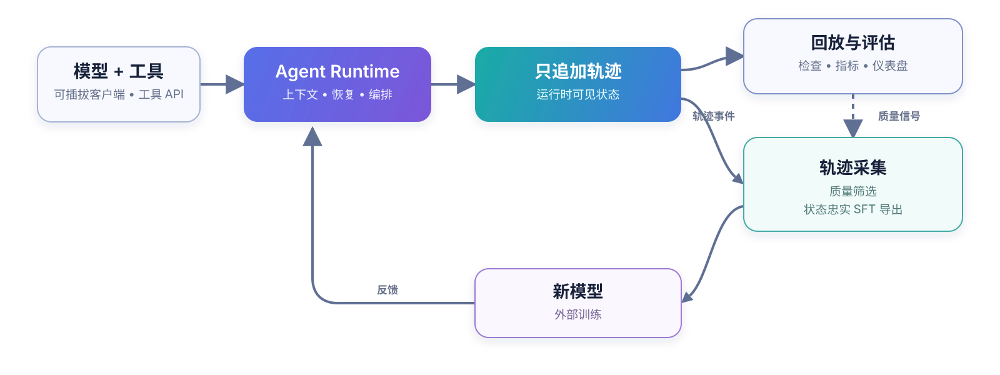

<div align="center">
  <picture>
    <source media="(prefers-color-scheme: dark)" srcset="docs/assets/axisagentic-logo-dark.svg">
    <source media="(prefers-color-scheme: light)" srcset="docs/assets/axisagentic-logo-light.svg">
    
  </picture>

  <p>
    <a href="README.md">English</a> ·
    <strong>简体中文</strong>
  </p>

  <p>
    <a href="https://github.com/XYZ-AI-Lab/AxisAgentic/actions/workflows/ci.yml"></a>
    
    <a href="https://github.com/astral-sh/ruff"></a>
    <a href="LICENSE"></a>
    <a href="CONTRIBUTING.md"></a>
  </p>

  <p>
    <a href="https://xyz-lab.ai">XYZ AI Lab</a> ·
    <a href="https://xyz-lab.ai/blogs/ai4ai-at-scale/">技术报告</a>
  </p>
</div>

AxisAgentic 是面向长时程 AI 智能体的可扩展运行时，也负责采集执行过程中产生的轨迹。它支持兼容 OpenAI 的端点和可插拔本地模型客户端，并提供多轮执行、工具编排、上下文管理、恢复和基准评估等能力。每条轨迹都保留模型实际可见的状态，因此同一份记录既可用于恢复、回放和基准评估，也可以经筛选后导出为 SFT 数据。

仓库目前提供 Web Search 和 WideSearch 两个参考 recipe。相同的扩展接口也能用于领域 Agent、通用 Agent 和编程 Agent。本仓库不包含模型权重。

## ✨ 核心能力

- 只追加轨迹保留运行时事件，并能重建模型在任意阶段实际可见的上下文。
- 模型客户端、工具、编排器、数据集、评估器、奖励函数和 recipe 策略均可替换。
- 上下文预算、压缩、回滚、重试与恢复、自我验证和工具限制用于支撑长时程运行。
- 每个任务都会记录轨迹、token 与耗时指标、评估产物，以及轨迹筛选所需的来源信息。
- SFT exporter 按运行时可见性规则重放轨迹，rollout 接口则负责连接外部训练系统。
- 严格的 YAML schema 和可移植路径方案让运行记录可以跨环境复现。

## 🔁 从执行到学习

每个任务都会写入一条只追加轨迹。这份记录是回放、评估和轨迹采集的共同输入。筛选后的轨迹可以继续导出给外部训练流程。

<picture>
  <source media="(prefers-color-scheme: dark)" srcset="docs/assets/axisagentic-execution-learning-loop-zh-CN-dark.svg">
  <source media="(prefers-color-scheme: light)" srcset="docs/assets/axisagentic-execution-learning-loop-zh-CN-light.svg">
  
</picture>

运行时通过 marker 记录 rollback、context compaction 和 discard-all。重放这些 marker 可以还原模型在具体阶段看到的上下文。轨迹检查和 SFT 导出遵循同一套规则，因此不会把不可见历史或已回滚的动作写入监督样本。

内置 exporter 可以生成 Swift Agent 等训练格式，并保留 source trace、任务状态和可选元数据。外部训练流程负责最终的正确性筛选、loss mask 和优化。AxisAgentic 提供回放与导出边界，让推理和训练使用同一份交互历史。

## 🦅 旗舰参考系统：XYZ-Aquila

XYZ-Aquila 是基于 AxisAgentic 构建的搜索系统。它的 recipe 将搜索和抓取与上下文管理、恢复、评估、状态忠实的 SFT 导出组合在一起。底层接口也适用于其他模型客户端、工具和任务领域。

### 📊 评测结果

[Aquila 技术报告](https://xyz-lab.ai/blogs/ai4ai-at-scale/)给出了 XYZ-Aquila-mini 和 XYZ-Aquila-pro 在七项智能体基准上的评测结果。下图复现了其中六项基准的对比。


*图中指标：BrowseComp、BrowseComp-ZH、LiveBrowseComp 和 Humanity's Last Exam 使用 LLM-judge accuracy；DeepSearchQA 使用 macro F1；WideSearch 使用 item-level F1 Max@4。详情请参阅[评估与可复现性](docs/evaluation.zh-CN.md)。*

部分基线数值来自公开报告，所用评测框架、工具、裁判模型和日期并不相同。这张图适合做基准层面的对照，不能视为同一受控实验下的通用排名。

## 🚀 快速开始

AxisAgentic 需要 Python 3.12 或更高版本，以及一个 OpenAI 兼容模型端点。[快速开始](docs/getting-started.zh-CN.md)介绍安装、服务变量、recipe 配置、dry run、回放和 SFT 导出；完整配置项见[配置](docs/configuration.zh-CN.md)。

```bash
git clone https://github.com/XYZ-AI-Lab/AxisAgentic.git
cd AxisAgentic
python3.12 -m venv .venv
source .venv/bin/activate
./setup_env.sh
source .envs/axis_agentic_env.sh
cp .env.example .envs/.env
```

配置好模型服务和数据集后，可以在不启动任务的情况下校验 Web Search recipe：

```bash
cp recipe/web_search/configs/default.yaml my-search-run.yaml
python -m recipe.web_search.runners.run_eval_config \
  --config my-search-run.yaml \
  --dry-run
```

## 📚 文档

- [文档索引](docs/README.zh-CN.md)
- [快速开始](docs/getting-started.zh-CN.md)
- [配置](docs/configuration.zh-CN.md)
- [架构](docs/architecture.zh-CN.md)
- [项目结构](docs/project-structure.zh-CN.md)
- [评估与可复现性](docs/evaluation.zh-CN.md)
- [Recipes](recipe/README.md)

## 🤝 参与贡献

[贡献指南](CONTRIBUTING.md)介绍开发环境和提交前检查。参与者需要遵守[行为准则](CODE_OF_CONDUCT.md)。安全漏洞请按[安全策略](SECURITY.md)上报。

## 📜 许可证

除非另有说明，AxisAgentic 采用 [Apache License 2.0](LICENSE) 许可。第三方归属和许可说明请参阅 [NOTICE](NOTICE)。

## 📝 引用

如果你使用了本代码库，请引用以下软件条目：

```bibtex
@software{wang2026axisagentic,
  author       = {Wang, Jinyu and Zhang, Yifei and {{XYZ Agentic Team}}},
  title        = {AxisAgentic: An Extensible Runtime and Trajectory-Collection Framework for Long-Horizon Agents},
  organization = {XYZ AI Lab},
  year         = {2026},
  url          = {https://github.com/XYZ-AI-Lab/AxisAgentic}
}
```
