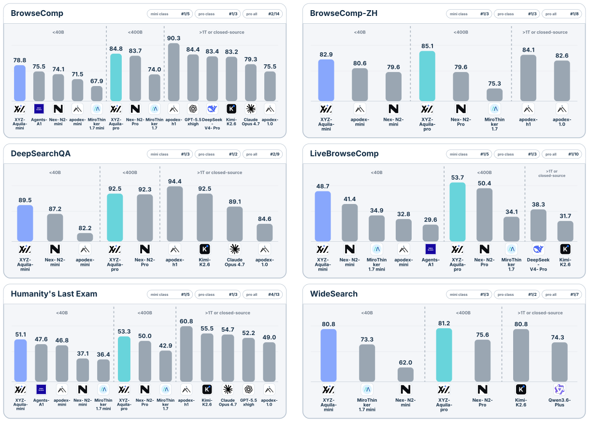

<div align="center">
  <picture>
    <source media="(prefers-color-scheme: dark)" srcset="docs/assets/axisagentic-logo-dark.svg">
    <source media="(prefers-color-scheme: light)" srcset="docs/assets/axisagentic-logo-light.svg">
    
  </picture>

  <p>
    <a href="README.md">English</a> ·
    <strong>简体中文</strong>
  </p>

  <p>
    <a href="https://github.com/XYZ-AI-Lab/AxisAgentic/actions/workflows/ci.yml"></a>
    
    <a href="https://github.com/astral-sh/ruff"></a>
    <a href="LICENSE"></a>
    <a href="CONTRIBUTING.md"></a>
  </p>

  <p>
    <a href="https://xyz-lab.ai">XYZ AI Lab</a> ·
    <a href="https://xyz-lab.ai/blogs/ai4ai-at-scale/">技术报告</a>
  </p>
</div>

AxisAgentic 是一个可扩展的运行时与评估框架，用于通过兼容 OpenAI 的端点和可插拔本地模型客户端构建长时程 AI 智能体。它提供状态保真的多轮执行、工具编排、上下文管理、结构化轨迹、基准评估和训练数据导出，并将可复用运行时与任务特定的 recipe、提示词、工具、数据集和评估器相分离。

当前版本通过面向搜索任务的 XYZ-Aquila recipe 展示该框架。核心运行时并不局限于搜索场景，其扩展点可用于构建更多特定领域、通用型和编程智能体 recipe。本仓库不包含模型权重。

## 核心能力

- 基于只追加轨迹实现状态保真的对话执行，可精确重建每个模型轮次实际可见的上下文。
- 可插拔的模型客户端、工具、编排器、数据集、评估器、奖励函数和 recipe 级控制策略。
- 面向长时程任务的上下文预算、压缩、回滚、重试与恢复、自我验证和工具限制。
- 结构化任务轨迹、耗时与 token 指标、增量评估产物和对比仪表盘。
- 可回放的 SFT 导出和 rollout 接口，用于连接智能体执行与学习系统。
- 严格、可复现的 YAML 配置，并为数据、模型和日志提供可移植路径方案。

## 旗舰参考系统：XYZ-Aquila

XYZ-Aquila 是首个基于 AxisAgentic 构建的旗舰系统。它面向长时程搜索任务，结合稳定的搜索、抓取和可选代码执行语义，以及上下文管理、恢复、验证、评估和状态保真的 SFT 导出，展示了框架的完整能力。

[Aquila 技术报告](https://xyz-lab.ai/blogs/ai4ai-at-scale/)将智能体改进描述为在人类定义的优化契约下进行的有界探索。人类指定目标能力、私有开发基准、允许的干预方式、资源与风险边界以及验收策略；AI 智能体则可以从数据、学习、运行时、上下文、工具和基础设施等方面探索改进方案，同时由隔离的评估器负责验收，且不暴露隐藏标签。

### 结果

报告评估了两个系统：基于 Qwen3.6-35B-A3B 的 XYZ-Aquila-mini，以及基于 Qwen3.5-397B-A17B 的 XYZ-Aquila-pro。在报告给出的开放权重模型对比中，Aquila-mini 在 40B 以下规模的表格中领先所有报告列，Aquila-pro 在 400B 以下规模的表格中同样领先所有报告列。报告还记录了 Aquila-mini 在 GAIA 上取得 97.1 分。



| 模型 | BrowseComp | BrowseComp-ZH | DeepSearchQA F1 | LiveBrowseComp | HLE | WideSearch Item F1 Max@4 |
| --- | ---: | ---: | ---: | ---: | ---: | ---: |
| XYZ-Aquila-mini | 78.8 | 82.9 | 89.5 | 48.7 | 51.1 | 80.8 |
| XYZ-Aquila-pro | 84.8 | 85.1 | 92.5 | 53.7 | 53.3 | 81.2 |

部分对比数值来自公开报告，这些报告使用的评测框架、工具、裁判模型和评估日期可能不同。因此，这些数字应被理解为基准层面的对比，而非在同一受控条件下得出的通用排名。详情请参阅[评估与可复现性](docs/evaluation.md)。

## 快速开始

AxisAgentic 需要 Python 3.12 或更高版本，以及一个兼容 OpenAI 的模型端点。

```bash
git clone https://github.com/XYZ-AI-Lab/AxisAgentic.git
cd AxisAgentic
python3.12 -m venv .venv
source .venv/bin/activate
./setup_env.sh
source .envs/axis_agentic_env.sh
cp .env.example .envs/.env
```

要试用当前的 Web Search 参考 recipe，请复制其配置，设置数据集和模型服务参数，并在正式启动前验证解析后的运行配置：

```bash
cp recipe/web_search/configs/default.yaml my-search-run.yaml
python -m recipe.web_search.runners.run_eval_config \
  --config my-search-run.yaml \
  --dry-run
```

## 文档

- [文档索引](docs/README.zh-CN.md)
- [快速开始](docs/getting-started.zh-CN.md)
- [配置](docs/configuration.zh-CN.md)
- [架构](docs/architecture.zh-CN.md)
- [项目结构](docs/project-structure.zh-CN.md)
- [评估与可复现性](docs/evaluation.zh-CN.md)
- [Recipes](recipe/README.md)

## 参与贡献

欢迎贡献。开发环境搭建及提交需通过的检查项，请阅读[贡献指南](CONTRIBUTING.md)，并遵守我们的[行为准则](CODE_OF_CONDUCT.md)。如需上报安全漏洞，请参阅[安全策略](SECURITY.md)。

## 许可证

除非另有说明，AxisAgentic 采用 [Apache License 2.0](LICENSE) 许可。第三方归属和许可说明请参阅 [NOTICE](NOTICE)。

## 引用

如果你使用了本代码库，请引用以下软件条目：

```bibtex
@software{wang2026axisagentic,
  author       = {Wang, Jinyu and Zhang, Yifei and {{XYZ Agentic Team}}},
  title        = {AxisAgentic: An Extensible Runtime and Evaluation Framework for Long-Horizon Agents},
  organization = {XYZ AI Lab},
  year         = {2026},
  url          = {https://github.com/XYZ-AI-Lab/AxisAgentic}
}
```
