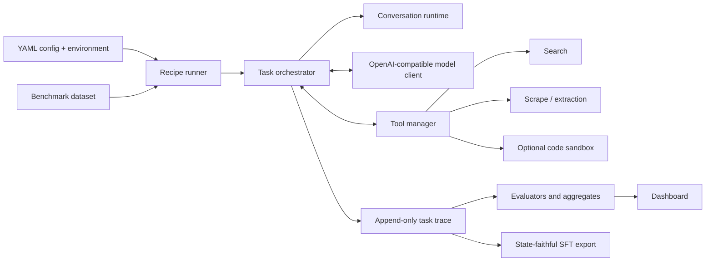

  <a href="../README.md">Home</a> ·
  <strong>English</strong> ·
  <a href="architecture.zh-CN.md">简体中文</a>

# Architecture

AxisAgentic separates reusable agent-runtime primitives from benchmark-specific recipes. The core library has no dependency on a particular benchmark; recipes assemble datasets, prompts, tools, policies, evaluators, and artifacts around it.

## Core runtime

### Contracts and conversation state

`agentic.contracts` defines messages, tool calls, results, and runtime markers. `agentic.conversations.ConversationRuntime` is the state machine for a task. It decides whether the next action is model generation, tool execution, finalization, rollback, or stop; enforces turn and context budgets; and materializes the model-visible conversation.

The full trace is append-only. Compaction, rollback, and discard operations are recorded as markers rather than destructive edits. Replaying those markers reconstructs the exact context presented at a given turn.

### Orchestration

`agentic.orchestration.TaskOrchestrator` runs the model/tool loop. It normalizes tasks, requests completions, dispatches structured tool calls, handles context-limit failures, calculates rewards, and synchronizes trace state. Recipes subclass it when a benchmark needs specialized retry, answer, or verification behavior.

The web-search orchestrator adds duplicate-query handling, attempt budgets, context strategies, self-verification, failure summaries, generation-limit recovery, and boxed-answer extraction. WideSearch reuses that behavior with its own prompts and final-answer format.

### Models and tools

`agentic.model_clients` provides an asynchronous OpenAI-compatible client with endpoint profiles, reasoning-content preservation, retry/backoff, token usage, and optional request logging.

`agentic.tools.ToolManager` owns registration, schema validation, execution limits, argument repair, lifecycle hooks, metrics, and tool traces. The current Aquila reference recipe centers on search, scrape, and Python, with optional E2B-backed code execution. These tools are one composition of the runtime: domain-specific, general-purpose, or coding-agent recipes can register different tools and evaluators without changing the core execution model.

### Observability and data products

`agentic.observability.TaskLogger` writes task traces, timing, token use, tool calls, status, and resolved configuration. Recipe post-processing turns those traces into compact evaluation and dashboard artifacts. `agentic.sft_export` and recipe exporters replay visible state to produce aligned supervised examples.

`agentic.rl` exposes a small rollout facade/client boundary for external integrations. This repository does not include full online RL infrastructure.

## Request lifecycle

1. A recipe runner loads YAML, loads missing environment values, validates the strict schema, resolves paths, and writes input/effective configs.
2. The dataset scheduler starts bounded concurrent tasks and creates one orchestrator state per task.
3. The conversation runtime builds the exact visible message list and the model client requests the next assistant action.
4. Final text is recorded, or structured tool calls are validated and executed by the tool manager.
5. Messages, state markers, tool outcomes, usage, and timing are appended to the trace before the next turn.
6. Completion triggers benchmark-specific verification and incremental aggregate artifacts.
7. The same trace can later be inspected in the dashboard, replayed, rejudged, or exported for SFT.

## Extension points

- Implement `agentic.tools.base.Tool` to add a tool with a JSON schema and async execution.
- Implement `agentic.model_clients.base.ModelClient` for a non-OpenAI transport.
- Subclass `ConversationRuntime` or `TaskOrchestrator` for new state or control policies.
- Implement dataset/evaluator contracts under `agentic.datasets` and `agentic.evaluation`.
- Add a self-contained package under `recipe/` when a benchmark needs its own config, prompts, runner, and evaluation artifacts.
