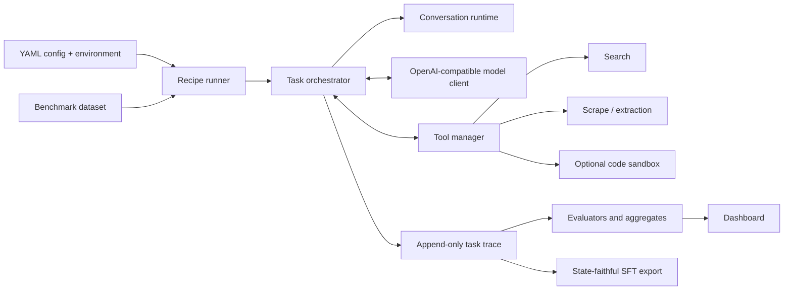

  <a href="../README.zh-CN.md">首页</a> ·
  <a href="architecture.md">English</a> ·
  <strong>简体中文</strong>

# 架构

AxisAgentic 将可复用的智能体运行时原语与任务特定的 recipe 分离。核心库不依赖任何特定基准；recipe 围绕核心库组装数据集、提示词、工具、策略、评估器和产物。

## 核心运行时

### 契约与对话状态

`agentic.contracts` 定义消息、工具调用、结果和运行时标记。`agentic.conversations.ConversationRuntime` 是单个任务的状态机，负责判断下一步动作是模型生成、工具执行、最终回答、回滚还是停止；执行轮次和上下文预算限制；并物化模型实际可见的对话。

完整轨迹采用只追加结构。压缩、回滚和丢弃操作会记录为标记，而不是对历史进行破坏性编辑。重放这些标记可以重建指定轮次向模型呈现的精确上下文。

### 编排

`agentic.orchestration.TaskOrchestrator` 运行模型与工具循环。它负责规范化任务、请求 completion、分发结构化工具调用、处理上下文限制错误、计算奖励并同步轨迹状态。当基准需要特定的重试、回答或验证行为时，recipe 可以继承该类。

Web Search 编排器增加了重复查询处理、尝试预算、上下文策略、自我验证、失败摘要、生成限制恢复和 boxed answer 提取。WideSearch 复用这些行为，并使用自己的提示词和最终回答格式。

### 模型与工具

`agentic.model_clients` 提供异步的 OpenAI 兼容客户端，支持端点 profile、推理内容保留、重试与退避、token 使用统计和可选请求日志。

`agentic.tools.ToolManager` 负责工具注册、schema 验证、执行限制、参数修复、生命周期 hook、指标和工具轨迹。当前 Web Search 参考 recipe 以搜索、抓取和 Python 为核心，并支持可选的 E2B 代码执行。这些工具只是运行时的一种组合方式：特定领域、通用型或编程智能体 recipe 可以注册不同的工具和评估器，而无需改变核心执行模型。

### 可观测性与数据产物

`agentic.observability.TaskLogger` 写入任务轨迹、耗时、token 使用、工具调用、状态和解析后的配置。Recipe 后处理将这些轨迹转换为紧凑的评估与仪表盘产物。`agentic.sft_export` 和 recipe 导出器通过重放可见状态生成对齐的监督样本。

`agentic.rl` 为外部集成提供轻量的 rollout facade/client 边界。本仓库不包含完整的在线 RL 基础设施。

## 请求生命周期

1. Recipe runner 加载 YAML，补充缺失的环境变量，验证严格 schema，解析路径，并写入输入配置和最终生效配置。
2. 数据集调度器以受限并发启动任务，并为每个任务创建独立的编排器状态。
3. 对话运行时构造精确的可见消息列表，模型客户端请求下一个 assistant 动作。
4. 如果得到最终文本则记录文本；如果得到结构化工具调用，则由工具管理器验证并执行。
5. 在进入下一轮之前，将消息、状态标记、工具结果、用量和耗时追加到轨迹。
6. 任务完成后触发基准特定的验证和增量聚合产物生成。
7. 同一轨迹之后可以在仪表盘中查看，也可以重放、重新评判或导出为 SFT 数据。

## 扩展点

- 实现 `agentic.tools.base.Tool`，添加具有 JSON schema 和异步执行能力的工具。
- 实现 `agentic.model_clients.base.ModelClient`，接入非 OpenAI 传输协议。
- 继承 `ConversationRuntime` 或 `TaskOrchestrator`，实现新的状态或控制策略。
- 在 `agentic.datasets` 和 `agentic.evaluation` 下实现数据集与评估器契约。
- 当某类任务需要独立配置、提示词、runner 和评估产物时，在 `recipe/` 下添加自包含 package。
